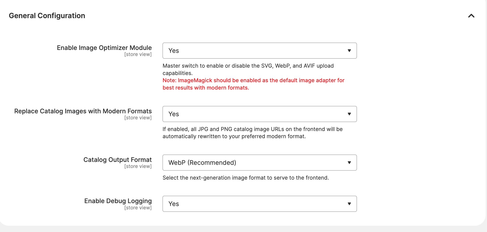
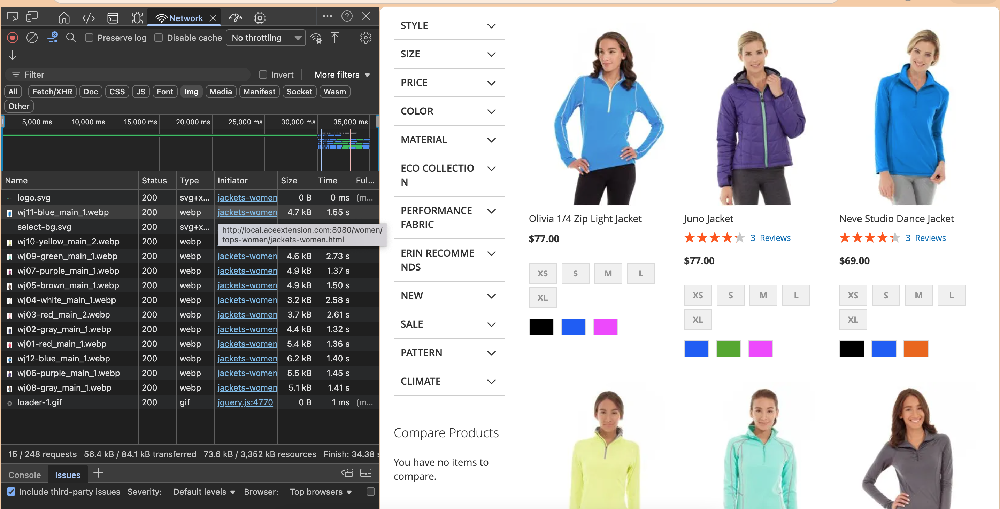

# Aceextension Image Optimizer for Magento 2

A premium, high-performance image optimization suite for Magento 2 that brings modern image formats (WebP, AVIF, SVG) and intelligent lazy-processing to your storefront.

## 🌟 Key Features

### 🖼️ Modern Image Format Support

- **WebP & AVIF Generation**: Automatically serves ultra-compressed WebP and AVIF images to modern browsers, reducing page weight by up to 80%.
- **SVG Upload Support**: Enables secure upload and display of SVG vector graphics in product galleries, category banners, and CMS pages.
- **Enhanced Media Gallery**: Extends the Magento Admin to support modern formats across Product Images, Category Attributes, and the WYSIWYG Media Gallery.

### 🚀 Performance Breakthroughs

- **Near-Zero Rendering Delay**: Revolutionizes image processing by deferring physical file generation from the initial page request to `pub/get.php`. This ensures near-instant TTFB (Time to First Byte).
- **Graceful Nativization**: Intelligently handles source images that are natively WebP or PNG without forcing unnecessary JPEG conversions.
- **Lazy Materialization**: Images are generated only when requested by the browser. If a user never scrolls to an image, it is never processed, saving CPU and disk cache.

### 🛠️ Technical Excellence

- **PHP 8.1+ Optimized**: Fully modern codebase adhering to Magento 2 coding standards, strict typing, and PHP 8+ features.
- **ImageMagick Enforcement**: Intelligently hooks into the Magento Admin to warn administrators and enforce the use of `ImageMagick` over `GD2` for superior modern format support.
- **Pure PHP Implementation**: Operates entirely within the PHP environment, requiring no external binaries or complex proxy configurations for standard operation.

## 📦 Installation via Composer (Packagist)

The recommended way to install this extension is via Composer.

```bash
composer require aceextension/module-imageoptimizer
bin/magento module:enable Aceextension_ImageOptmizer
bin/magento setup:upgrade
bin/magento cache:clean
```

## ⚙️ Configuration

Available under **Stores > Configuration > Aceextension > Image Optimizer**:

* **Module Enabled**: The master switch for the module's validation and processing logic.
* **Replace Catalog Images with Modern Formats**: Toggles the automated URL rewriting on the frontend.
* **Catalog Output Format**: Select between WebP and AVIF for frontend output.
* **Enable Debug Logging**: Log detailed conversion and processing events to `var/log/system.log`.



## 🏗 Architecture Overview

The module utilizes a **Lazy Materialization** pattern:

1. **URL Hijacking**: Intercepts URL generation and rewrites `.jpg`/`.png` extensions to `.webp`.
2. **Processing Bypass**: Stops Magento from physically creating the resized file during the initial page request.
3. **On-Demand Processing**: When the browser requests the missing `.webp` file:
   - Nginx routes the request to `pub/get.php`.
   - Our `MediaPlugin` intercepts the request.
   - The plugin generates the required source image and instantly converts it to WebP/AVIF.
   - The optimized image is served with correct headers.



## 📋 Compatibility

- **Magento**: 2.4.4 / 2.4.5 / 2.4.6 / 2.4.7+
- **PHP**: 8.1 / 8.2 / 8.3
- **Graphics Library**: ImageMagick (Strongly Recommended & Enforced via Admin UI Warning)
- **Note**: This module utilizes safe PHP Reflection on `Magento\Framework\Image\Adapter\Gd2` and `Magento\MediaStorage\App\Media` to enable modern format generation without core file modification.

## 📄 Recent Changes (Hardening)

The following security and stability improvements were implemented in the recent release:

- **Harden AVIF handling**: Added guards for `imageavif` and `imagecreatefromavif`, ensuring graceful fallback to WebP if the server environment lacks native AVIF support.
- **SVG security**: Introduced an `enable_svg` configuration toggle to whitelist SVG uploads and implemented an `aroundOpen` plugin to prevent backend raster adapters from attempting to process vector graphics.
- **Reflection resilience**: Documented target Magento versions and introduced a "log once" mechanism for reflection failures to avoid log noise while maintaining visibility.
- **Centralized URL rewriting**: Consolidated all URL replacement logic into a single idempotent helper method to ensure consistent behavior across all frontend plugins.
- **Admin UX**: Added a Diagnostics report in the Store Configuration panel to provide instant visibility into PHP-GD/Imagick format capabilities.

## 📄 License

Copyright (c) 2019 Aceextensions Extensions (http://aceextensions.com)
